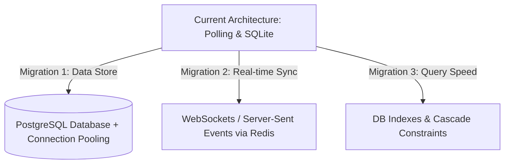

# Production Readiness Audit & Enterprise Scaling Report

This audit assesses the smart hospital platform's architecture, database mapping, and runtime efficiency against the standards of a real-world enterprise healthcare system (e.g., handling 10,000+ daily patient visits).

---

## 1. System Health Check (What is Currently Verified & Working)

The core workflows are fully verified, timezone-safe, and operational in our local sandbox:
1. **Reception Workspace**: Walk-in registration, cash billing, and direct check-in updates work in real-time.
2. **Dynamic Queue & ETA**: Patients check in, get prioritized by clinical ESI acuity/red flags, and route to the correct doctor's room. ETAs adjust automatically when the queue shifts.
3. **Doctor Workspace**: Ambient transcription, structured clinical SOAP notes drafting, and clinical decision support (CDS) safety checks run correctly.
4. **Patient Portal**: Patients can view active vitals, check-in queue stages, and e-signed prescriptions cleanly.

---

## 2. Database Mapping & Integrity Audits

To support thousands of daily records, several database constraints must be adjusted:

### 🔴 Critical Scaling Gaps: Missing Indexes
Without explicit indexes, queries on large tables trigger full table scans, causing clinic dashboards to lag.
* **`patient.mobile`**: Queried on every lookup/search. Needs an index to ensure sub-millisecond search times.
* **`encounter.arrival_ts`**: Queried continuously to build the daily triage and doctor queues. Needs an index.
* **`appointment.scheduled_start`**: Queried to calculate slot availability. Needs an index.
* **`token.status` & `encounter.status`**: Filtered continuously to identify "waiting" vs. "discharged" patients. Needs indexes.

### 🟡 Data Integrity Gaps: Cascade Deletions
* Currently, columns like `Triage.encounter_id`, `Vitals.encounter_id`, and `Token.encounter_id` are defined as foreign keys but lack `ondelete="CASCADE"` instructions.
* In enterprise production databases (e.g., PostgreSQL), deleting a cancelled encounter or duplicate patient record will crash with foreign key violation constraints, or leave orphaned data cluttering the tables.

---

## 3. Real-World Healthcare Integration Gaps

To deploy this in a real hospital (e.g., in India), these regulatory and clinical integrations are pending:

### 🔒 ABDM (Ayushman Bharat Digital Mission) Compliance
Real-world Indian platforms must integrate with the government's ABDM registry:
* **ABHA Verification**: The platform currently mocks ABHA validation. In production, this requires actual integration with the ABDM NHA gateway (using Aadhaar OTP or biometric authentication).
* **HL7 FHIR Profiles**: The JSON fields in the database (e.g. prescription items, lab analytes) must be validated against the national FHIR (Fast Healthcare Interoperability Resources) data models.

### 💳 Real Payment & Refund Gateway Transactions
* The current workspace uses mock functions (`api.invoice` and `api.pay`) which assume cash collection or mock success.
* In production, this requires Razorpay/UPI dynamic QR code generation on the reception screen, credit card machine POS APIs, and automated refund handling for cancelled appointments.

---

## 4. Scalability & Performance Roadmap

To eliminate lag and support massive hospital throughput, the following technical migrations are required:

### 1. Database Store Migration
* **Current**: SQLite is used for lightweight sandbox development.
* **Production**: Migrate to **PostgreSQL**. Set up connection pooling (using PgBouncer) to manage the hundreds of concurrent database connections from doctor, nurse, and reception client screens.

### 2. Network Sync: WebSockets/SSE vs. Polling
* **Current**: Frontends use React Query polling (`refetchInterval: 5000`) to refresh queues every 5 seconds.
* **Production**: Polling creates high CPU load under scale. Change to **WebSockets** or **Server-Sent Events (SSE)** driven by Redis Pub/Sub. The backend will broadcast events (e.g. `Topics.TOKEN_ISSUED`) to automatically trigger immediate, silent dashboard updates.

### 3. Session Caching
* Cache the operational KPIs (like queue sizes and average wait times) in **Redis** with short TTLs rather than recalculating counts on the database for every dashboard refresh.
